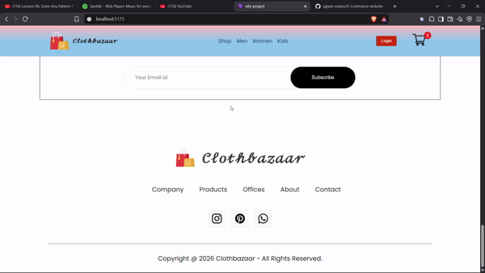

# 🛒 Clothbazaar — Modern E-Commerce Web Application

[](https://vite-project-beta-self.vercel.app/)
[](https://react.dev/)
[](https://vitejs.dev/)
[](https://reactrouter.com/)

A modern, fast, and responsive e-commerce web application built using **React 19**, **Vite**, **React Router v7**, and **Context API**. Explore categories, view detailed product pages, manage your shopping cart in real time, and enjoy a seamless online shopping experience.

---

## 🌐 Live Website

🔗 **Visit the live application:** [https://vite-project-beta-self.vercel.app/](https://vite-project-beta-self.vercel.app/)

## 🎬 Demo



---

## ✨ Features

- **🛍️ Multi-Category Shopping:** Dedicated shopping sections for **Men**, **Women**, and **Kids** with banner showcases.
- **🔍 Detailed Product Pages:** Comprehensive product view featuring image galleries, pricing, size selection, ratings, and breadcrumb navigation.
- **🛒 Dynamic Cart System:**
  - Real-time cart counter in navbar
  - Add & remove items dynamically
  - Promo code discount input
  - Automatic order summary & subtotal calculations
- **🔥 Trending & Offers:**
  - "Popular in Women" highlights
  - "Exclusive Offers" promo sections
  - "New Collections" showcase
- **✉️ Newsletter Subscription:** Integrated newsletter section for email subscriptions.
- **🔐 User Authentication UI:** Sleek Login and Sign-Up authentication page.
- **📱 Fully Responsive:** Mobile-friendly design optimized across desktops, tablets, and phones.
- **⚡ Lightning-Fast Performance:** Powered by Vite bundler with instant HMR and optimized production builds.

---

## 🛠️ Tech Stack

- **Frontend Library:** [React 19](https://react.dev/)
- **Build Tool / Bundler:** [Vite](https://vitejs.dev/)
- **Routing:** [React Router v7](https://reactrouter.com/)
- **State Management:** React Context API (`ShopContext`)
- **Styling:** Modular Vanilla CSS with smooth transitions and modern aesthetics
- **Deployment:** [Vercel](https://vercel.com/)

---

## 📂 Project Structure

```text
E-Commerce-website/
├── vite-project/
│   ├── public/
│   ├── src/
│   │   ├── Assets/             # Product images, icons, and banners
│   │   ├── Components/
│   │   │   ├── Breadcrums/     # Breadcrumb navigation component
│   │   │   ├── Cartitems/      # Cart items list & checkout summary
│   │   │   ├── DescriptionBox/ # Product details and reviews tab
│   │   │   ├── Footer/         # Footer with social links & site map
│   │   │   ├── Hero/           # Hero banner section
│   │   │   ├── Items/          # Reusable product card component
│   │   │   ├── NewCollections/ # New arrivals showcase
│   │   │   ├── NewsLetter/     # Email newsletter subscription
│   │   │   ├── Offers/         # Exclusive promo banner
│   │   │   ├── Popular/        # Trending items section
│   │   │   └── ProductDisplay/ # Single product display & purchase actions
│   │   ├── Context/
│   │   │   └── ShopContext.jsx # Global shopping cart state & actions
│   │   ├── Navbar/
│   │   │   └── Navbar.jsx      # Navigation bar with responsive menu & cart badge
│   │   ├── Pages/
│   │   │   ├── Shop.jsx         # Homepage
│   │   │   ├── ShopCategory.jsx # Category listing (Men/Women/Kids)
│   │   │   ├── product.jsx      # Product view page
│   │   │   ├── cart.jsx         # Cart & checkout page
│   │   │   ├── loginsignup.jsx  # Authentication page
│   │   │   └── NotFound.jsx     # 404 error page
│   │   ├── App.css
│   │   ├── App.jsx             # Main routing & layout configuration
│   │   ├── index.css
│   │   └── main.jsx            # Entry point with ShopContextProvider
│   ├── package.json
│   └── vite.config.js
└── README.md
```

---

## 🚀 Getting Started

Follow these steps to run the project locally on your machine.

### Prerequisites

Make sure you have [Node.js](https://nodejs.org/) installed (version 18+ recommended) and `npm`.

### Installation & Run

1. **Clone the repository:**
   ```bash
   git clone https://github.com/ujjwal-notpro/E-Commerce-website.git
   ```

2. **Navigate into the project directory:**
   ```bash
   cd "E commerce web/vite-project"
   ```

3. **Install dependencies:**
   ```bash
   npm install
   ```

4. **Start the local development server:**
   ```bash
   npm run dev
   ```

5. **Open in browser:**
   Open [http://localhost:5173](http://localhost:5173) in your browser to view the application.

---

## 📜 Available Scripts

Inside the `vite-project` directory, you can run:

| Command | Description |
| :--- | :--- |
| `npm run dev` | Starts the Vite development server with Hot Module Replacement (HMR) |
| `npm run build` | Compiles and optimizes the React app for production into `dist/` |
| `npm run preview` | Locally previews the production build |
| `npm run lint` | Runs ESLint to check for code quality and issues |

---

## 🚀 Deployment

The project is configured for deployment on platforms like [Vercel](https://vercel.com/) or [Netlify](https://www.netlify.com/).

To build for production:
```bash
npm run build
```

---

## 📄 License

This project is open source and available under the [MIT License](LICENSE).
